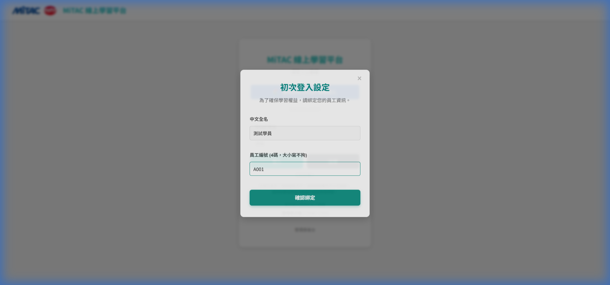
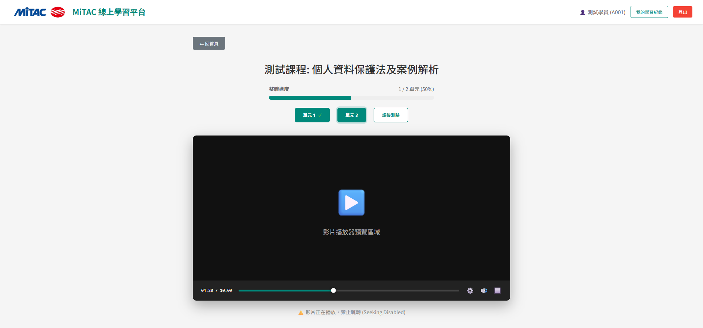
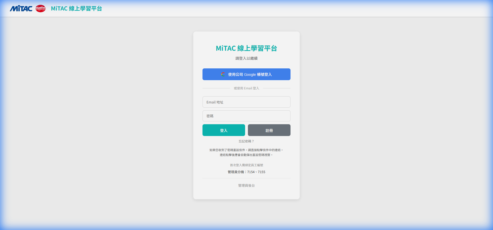
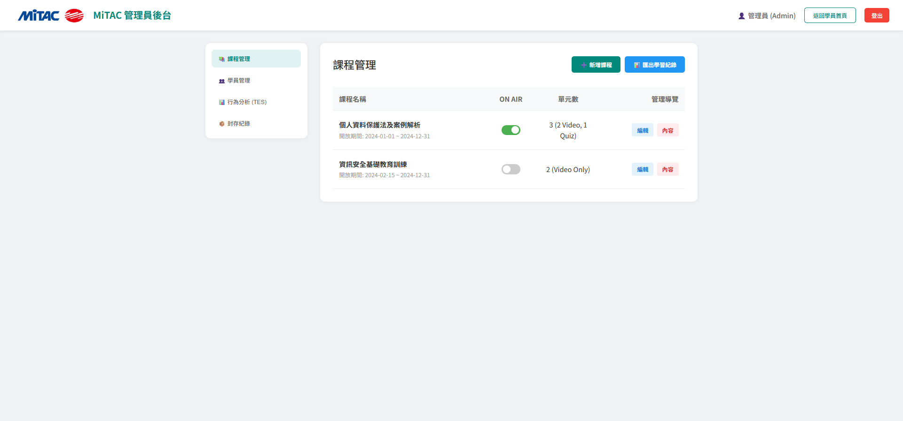
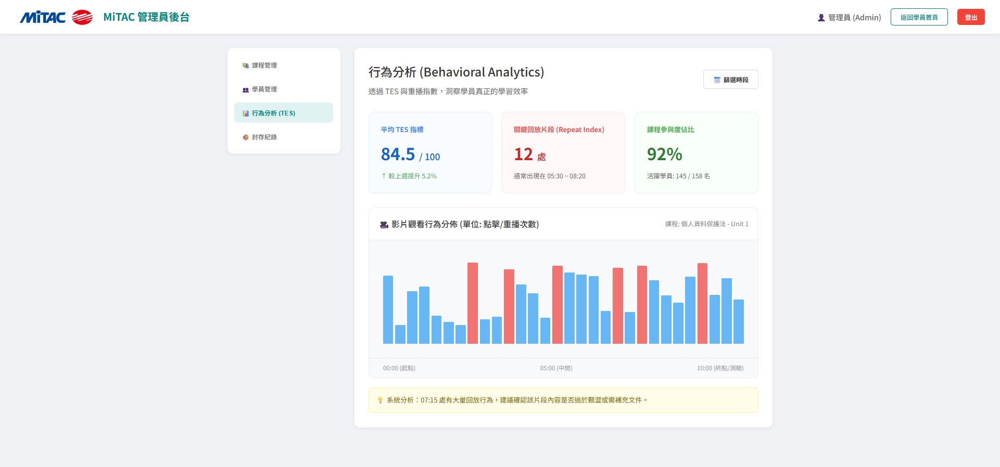

# MiTAC 線上教育訓練系統 - 使用手冊

本手冊旨在引導 **學習者 (員工)** 與 **系統管理員** 熟悉平台操作，確保教學流程順利執行。

---

## 📖 學習者篇 (Learner Guide)

### 1. 系統登入與身分綁定
本系統採用 **Google 帳號** 整合驗證。
- **首次登入**：
  1. 點擊「使用 Google 登入」。
  2. 登入後系統會彈出「身分綁定」視窗。
  3. 請輸入您的 **員工編號** 進行驗證與綁定。
  4. 綁定成功後，往後登入僅需點擊 Google 登入即可自動識別。
- **注意事項**：若登入時提示帳號不在許可名單內，請聯繫 HR 管理員。

*圖 1：初次登入時的身分綁定視窗*

### 2. 瀏覽與選擇課程
- **首頁看板**：登入後會看到目前開放的所有課程卡片。
- **課程進度**：卡片上會顯示「未開始」、「學習中 (xx%)」或「已完成」狀態。
- **年度篩選**：可透過畫面上方的年度選單切換至過去的歷史課程。

### 3. 影片學習規範 (核心規範)
- **禁止跳轉**：為了確保學習品質，學習者 **無法透過進度條快進** 未看過的片段。
- **自動存檔**：系統每隔數秒會自動儲存您的觀看進度，若中途關閉視窗，下次進入將自動回到中斷點。
- **完成標準**：影片觀看進度必須達到 **90% 以上**，該單元才會被系統標記為「已完成」。

*圖 2：影片學習與進度追蹤介面*

### 4. 線上測驗流程
- **進入測驗**：點擊測驗單元，會開啟 Google Forms 頁面。
- **回報進度**：完成表單填寫後，返回平台視窗。系統設有 **10秒防呆倒數**，倒數結束後，請點擊「標記測驗為已完成」按鈕，進度才會更新。

### 5. 查看個人紀錄
- 點擊導覽列的 **「我的學習紀錄」**。
- 可檢視所有修課歷史、完成日期、以及各單元的詳細進度。

---

## 🛠️ 管理員篇 (Admin Guide)

### 1. 進入後台
- **登入方式**：具備管理員權限的帳號登入後，點擊頁面右上角的「管理員後台」或透過特定 URL 進入。
- **權限說明**：僅有在 Firestore 中 `role` 為 `admin` 的帳號可存取管理功能。

*圖 3：管理員後台切換入口*

### 2. 課程管理 (Courses)
- **新增課程**：設定課程標題、封面圖、開放區間（線上開放日 vs. 實際開課日）。
- **單元設定**：支援 YouTube 影片連結與外部測驗連結。
- **課程狀態 (ON AIR)**：切換開關可即時控制課程是否對學生顯示。
- **排序邏輯**：系統預設會按月份與日期自動對課程進行分組排序。

*圖 4：管理員課程列表管理 (含 ON AIR 狀態切換)*

### 3. 學員管理 (Users)
- **邀請/新增學員**：預先建立員工編號與 Email 映射，確保學生能順利綁定。
- **歷史歸檔**：離職員工或專案結束後，建議將學員設為「歸檔 (Archived)」而非刪除，以保留統計數據。
- **帳號修復**：若學員換帳號或綁定錯誤，管理員可解除綁定或修正 UID。

### 4. 數據統計與行為分析 (Analytics)
- **TES 真實參與度**：查看學員是否「真的在看」影片，而非掛網。
- **回放次數分析**：若某個片段被大量學員回放，代表該段落可能較難理解，可作為課程優化參考。

*圖 5：行為分析儀表板 (TES 與觀看行為熱點)*

### 5. 系統維護建議
- **每月檢查**：定期檢查是否有過期課程未關閉，以維持首頁整潔。
- **權限稽核**：定期確認管理員名單，避免權限外流。

---

*版本: 5.0.0*
*更新日期: 2026-02-11*
